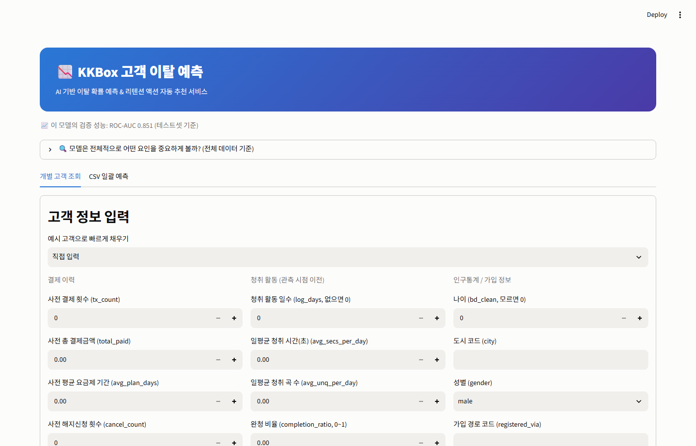
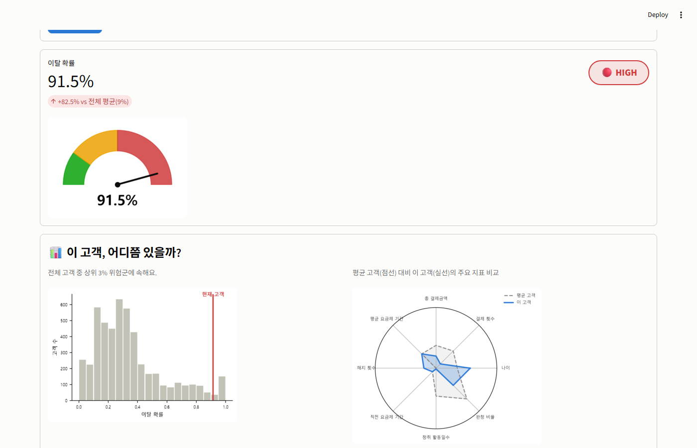
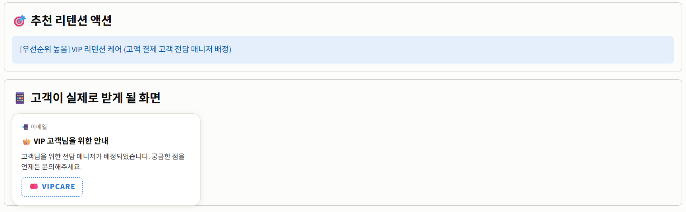
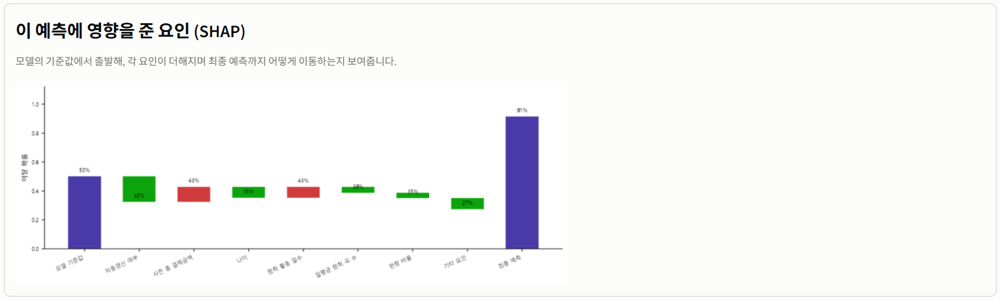
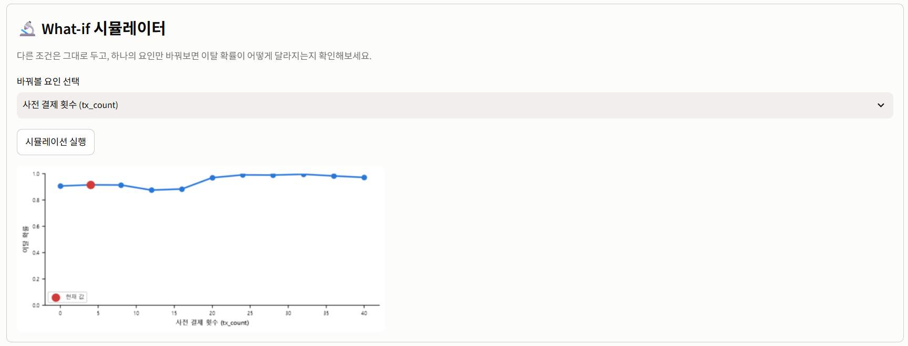
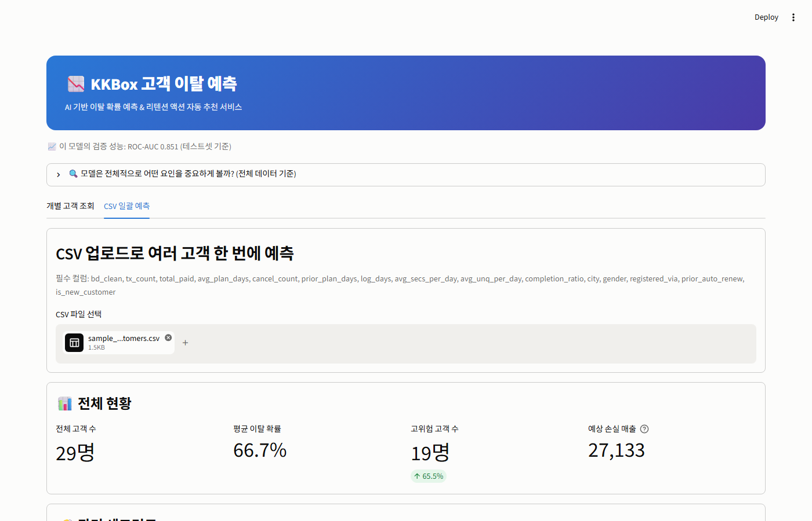
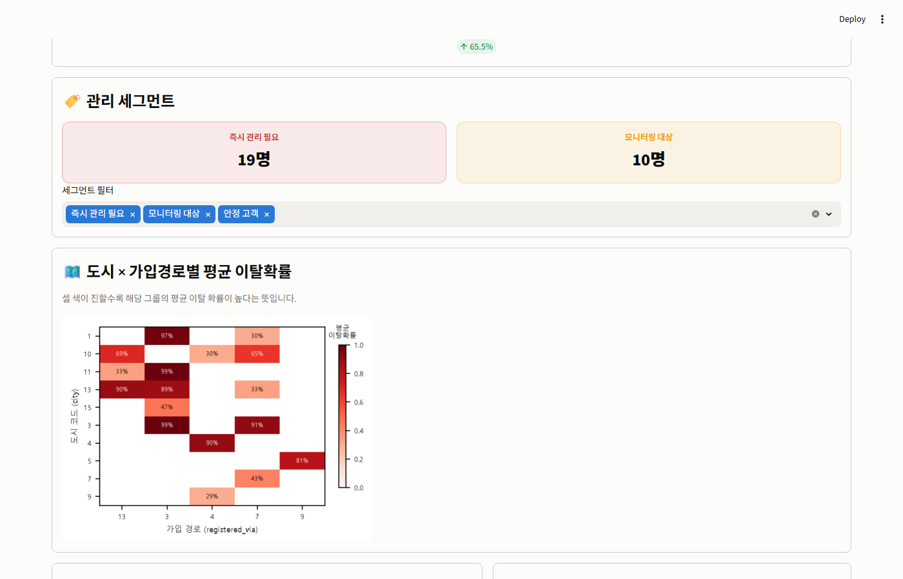
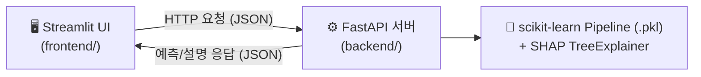

# 📉 KKBox 고객 이탈 예측 (Customer Churn Prediction)

실제 음악 스트리밍 서비스(KKBox)의 대규모 사용자 데이터로 고객 이탈을 예측하고, 예측 결과를 실무자가 바로 활용할 수 있는 형태로 서비스화한 엔드투엔드 프로젝트입니다.

노트북에서 모델을 만드는 데서 그치지 않고 **FastAPI 백엔드 + Streamlit 프론트엔드**로 서비스를 구성했고, 그 과정에서 데이터 누수·API 버그·메모리 이슈 등 실제 서비스 개발에서 마주치는 문제들을 직접 찾아 해결했습니다.

<br>

## 데모 스크린샷

**개별 고객 조회**


**위험도 게이지 + 고객 프로필 비교**


**추천 리텐션 액션 + 고객이 실제로 받게 될 화면**


**SHAP 기반 예측 설명**


**What-if 시뮬레이터**


**CSV 일괄 예측 - 전체 현황**


**도시 × 가입경로별 평균 이탈확률 히트맵**


<br>

## 프로젝트 설명

합성/더미 데이터가 아닌 [KKBox WSDM Cup 2018 Kaggle 대회](https://www.kaggle.com/c/kkbox-churn-prediction-challenge)의 실제 데이터(실사용자 97만 명, 결제 이력 1,600만 건, 청취 로그 수억 건)로 고객 이탈을 예측하는 모델을 만들고, EDA → 전처리 → 모델링 → API 서버 → 웹 UI까지 전 과정을 직접 구현했습니다.

- **엔드투엔드**: 노트북에 그치지 않고 FastAPI + Streamlit으로 실제 동작하는 서비스까지 구성
- **정직한 기록**: 잘 된 것과 안 된 것(하이퍼파라미터 튜닝 효과 미미 등)을 모두 그대로 기록
- **실제로 겪은 문제와 해결 과정**: 아래 "핵심 기술적 하이라이트" 참고

<br>

## 핵심 기술적 하이라이트

아래는 실제로 겪고 해결한 문제들입니다.

### 1. 데이터 누수(Data Leakage) 발견 및 제거
`transactions.csv`를 그대로 집계하면 "마지막 거래 정보"가 곧 이탈 여부를 결정짓는 사건 그 자체라서, 모델이 사실상 정답을 미리 보고 학습하게 됩니다. 각 고객의 **마지막 거래 1건을 제외**하고 그 이전 이력만으로 피처를 재설계했습니다.
- 검증 결과: `prior_auto_renew`는 누수 제거 후에도 강한 신호(38.2% vs 4.7% 이탈률)로 남았지만, `cancel_count`는 누수를 제거하자 신호가 거의 사라짐(9.2% vs 8.4%) — 원래 신호 대부분이 누수였다는 뜻

### 2. API·학습 데이터 간 인코딩 불일치 버그
전처리 과정에서 `city`/`registered_via`가 결측으로 인해 float 컬럼이 된 채로 문자열화되어 `"4.0"`, `"-1.0"` 형태로 학습되었는데, 실서비스 API는 사용자가 입력한 `"4"`를 그대로 넘겨 **인코더가 이를 "모르는 범주"로 처리해 해당 피처가 통째로 무시되는** 버그를 발견했습니다. (`city="4"`와 존재하지도 않는 `city="9999"`가 완전히 동일한 예측값을 내는 것으로 확인) API 경계에서 학습 시와 동일한 형식으로 정규화하도록 수정했습니다.

### 3. SHAP 설명과 실제 예측 확률의 불일치
SHAP 설명을 위해 희소 행렬을 밀집 배열로 변환하는 과정에서, XGBoost가 학습 시 "0을 결측으로 취급"하는 방식과 어긋나 **SHAP이 재구성한 확률(36.6%)이 실제 예측 확률(85.3%)과 다른** 심각한 불일치를 발견했습니다. 0을 다시 NaN으로 되돌리는 방식으로 SHAP 계산을 실제 예측과 정확히 일치시켰습니다.

### 4. 30GB 파일 처리 중 메모리 부족(MemoryError) 해결
청취 로그(`user_logs.csv`, 약 30.5GB)를 다른 파일과 같은 방식(필터링 후 전체 캐싱)으로 처리하려다 메모리 부족이 발생했습니다. 청크마다 **즉시 부분 집계 후 마지막에 합산**하는 스트리밍 방식으로 재설계해, 원본 데이터를 한 번에 메모리에 올리지 않고도 전체를 처리하도록 했습니다.

### 5. 원본 데이터 자체의 손상된 값 처리
`total_secs`(일일 재생 시간) 컬럼에 음수/수천조 단위의 명백히 손상된 값이 일부(~0.05%) 섞여 있어, 하루 최대치(86,400초)를 벗어나는 값은 집계에서 제외하도록 처리했습니다.

<br>

## 아키텍처



- **백엔드 (FastAPI)**: 학습된 모델을 로드해 `/predict`(개별), `/predict-batch`(CSV 일괄), `/model-info`(모델 전체 통계) 엔드포인트 제공. SHAP 기반 예측 설명, 위험도 분류, 리텐션 액션/고객 메시지 생성 로직 포함
- **프론트엔드 (Streamlit)**: 백엔드를 HTTP로 호출하는 순수 클라이언트. 게이지 차트, SHAP 워터폴, 고객 프로필 레이더 차트, What-if 시뮬레이터, 배치 CSV 업로드/세그먼트/히트맵 제공

<br>

## 데이터셋

[KKBox WSDM Cup 2018 - Churn Prediction Challenge](https://www.kaggle.com/c/kkbox-churn-prediction-challenge) (Kaggle)

| 파일 | 설명 | 크기 |
|---|---|---|
| `train_v2.csv` | 예측 대상 고객 + 이탈 라벨 (970,960명, 이탈률 9.0%) | 45MB |
| `members_v3.csv` | 회원 인구통계 정보 (도시, 나이, 성별, 가입 경로) | 428MB |
| `transactions.csv` + `transactions_v2.csv` | 결제/구독 거래 이력 | 1.7GB + 115MB |
| `user_logs.csv` + `user_logs_v2.csv` | 일별 청취 활동 로그 | 30.5GB + 1.4GB |

<br>

## 모델링 파이프라인

`notebooks/` 아래 3개 노트북이 순서대로 이어집니다.

1. **`01_eda.ipynb`**: 결측치/이상치 탐색, 데이터 누수 발견, `user_logs` 구조 확인
2. **`02_preprocessing.ipynb`**: 관측 시점 기준으로 안전한 피처 재설계 (거래 이력 + 청취 활동), train/test 분할
3. **`03_modeling.ipynb`**: 모델 비교, 하이퍼파라미터 튜닝, 성능 고도화(청취 활동 피처 추가), 시각화(혼동행렬/ROC·PR/SHAP), 최종 모델 저장

### 모델 비교 결과 (테스트셋 ROC-AUC)

| 모델 | ROC-AUC |
|---|---|
| Logistic Regression | 0.786 |
| Random Forest | 0.834 |
| **XGBoost (최종 채택)** | **0.851** |

### 성능 고도화 시도 기록

| 시도 | 결과 |
|---|---|
| 하이퍼파라미터 튜닝 (RandomizedSearchCV) | 0.8494 → 0.8488 (개선 없음) |
| 청취 활동 피처 추가 (`log_days`, `avg_secs_per_day`, `avg_unq_per_day`, `completion_ratio`) | 0.8494 → 0.8511 (소폭 개선) |
| 위 조합에 재튜닝 | 0.8511 → 0.8502 (역시 개선 없음) |

하이퍼파라미터 튜닝보다 피처 엔지니어링이 더 확실한 개선을 가져왔지만, 새 피처들이 개별 중요도 top 10에는 들지 못했습니다(`prior_auto_renew`가 여전히 72%로 압도적). 결제/구독 이력이 청취 활동보다 이탈을 훨씬 강하게 설명한다는 뜻으로, 과장 없이 그대로 기록했습니다.

<br>

## 서비스 기능

**개별 고객 조회**
- 반원형 게이지 차트로 이탈 확률 표시, 위험도 배지(low/medium/high)
- 전체 고객 분포 속 위치(백분위) + 평균 고객 대비 레이더 차트 비교
- SHAP 기반 워터폴 차트 (모델 기준값 → 각 요인의 기여 → 최종 예측)
- 위험 요인에 따른 추천 리텐션 액션 + 고객이 실제로 받게 될 알림/이메일 미리보기
- What-if 시뮬레이터: 특정 요인만 바꿔가며 이탈 확률 변화를 실시간 확인

**CSV 일괄 예측**
- 여러 고객을 한 번에 업로드해 전체 현황, 위험 세그먼트, 이탈 확률 분포 확인
- 도시 × 가입경로별 평균 이탈확률 히트맵
- 배치 결과에서 개별 고객으로 드릴다운해 상세 분석 확인

<br>

## 설치 및 실행

```bash
# 1. 가상환경 생성 및 라이브러리 설치
python -m venv myvenv
myvenv\Scripts\activate                  # Windows
pip install -r requirements.txt          # 노트북 실행용
pip install -r backend/requirements.txt
pip install -r frontend/requirements.txt

# 2. 데이터 준비
# Kaggle에서 kkbox-churn-prediction-challenge 데이터를 받아 data/ 폴더에 배치

# 3. 노트북 실행 (순서대로)
jupyter notebook notebooks/01_eda.ipynb
jupyter notebook notebooks/02_preprocessing.ipynb
jupyter notebook notebooks/03_modeling.ipynb

# 4. 백엔드 실행
cd backend
uvicorn main:app --reload --port 8000

# 5. 프론트엔드 실행 (새 터미널에서)
cd frontend
streamlit run app.py
```

브라우저에서 `http://localhost:8501` 접속. `samples/sample_batch_customers.csv`로 일괄 예측 기능을 바로 테스트할 수 있습니다.

<br>

## 프로젝트 구조

```
churn/
├── notebooks/
│   ├── 01_eda.ipynb                # 탐색적 데이터 분석 + 누수 발견
│   ├── 02_preprocessing.ipynb      # 관측 시점 기준 피처 엔지니어링
│   └── 03_modeling.ipynb           # 모델 학습·비교·튜닝·저장
├── backend/
│   ├── main.py                     # FastAPI 서버 (예측/설명/추천 로직)
│   └── requirements.txt
├── frontend/
│   ├── app.py                      # Streamlit UI
│   └── requirements.txt
├── data/                           # 원본/가공 데이터 (용량 문제로 저장소에는 미포함)
├── models/
│   └── kkbox_churn_model.pkl       # 최종 학습된 파이프라인
├── samples/
│   └── sample_batch_customers.csv  # 배치 예측 테스트용 샘플
├── docs/
│   └── screenshots/                # README 데모 스크린샷
└── requirements.txt                # 노트북 실행용
```

<br>

